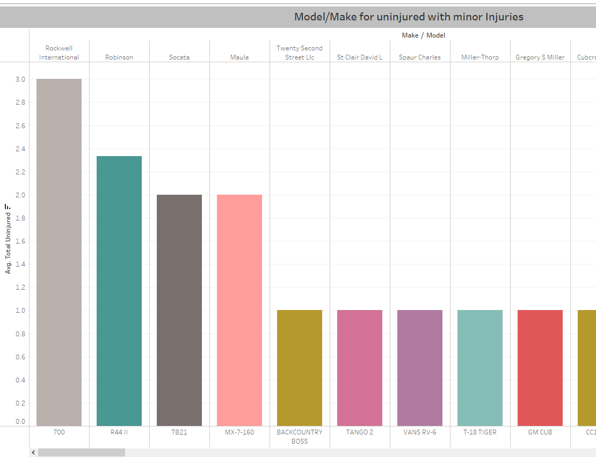

# LOW RISK AIRCRAFT MAKES AND MODEL ANALYSIS
## Overview
This project analyzes aircrafts accidents and incidents to deterrmine the low risk aicraft that aircraft a company can purchase as it begins operations in the aviation industry
## Business Problem
Our Company is expanding and wants to venture in purchasing and operating aircrafts for commercial and private enterprises, but do not know the potential risks of aircrafts. we are tasked to determine which aircraft are the lowest risk for the company to start this new business endeavor. We then translate finds into actionable insights that the head of the new aviation division can help decide which aiecraft to purchase


## Data Understanding
The data is an aviation dataset from the National Transportation safety board that includes aviation accidents from 1962 to 2023 about civil aviation accidents and selected incidents in the United states and international waters. Every accidents / incident has:

i) The injury severity category it falls into i.e (<font color='red'>Minor, Fatal,Non-fatal,serious or incidents</font>)

ii)The level of damage to the aircraft i.e (<font color='red'>Destroyed, substantial or minor</font>)

iii)The total number of **fatalities**, of **serious** injuries and of **uninjured**

iv)Purpose of flight whether its **personal**, **business** among others

### Data Analysis
This project uses descriptive analysis, including description of  makes/models by risk factor and with all risks combined as well. This provides a useful overview of on your best model to use depending on the risk you are willing to take and if none which model/make is best to use.
The data was cleaned by filling most colums with  NA with placeholder as i noticed most columns had placeholders. I only dropped rows where the data to be dropped was very small. I didnt want to lose data that would be meaningful. From our dataset these are real accidents and incidents, it doesnt seem sensible to fill with the most common therefor i avoided filling with mode values.

### Results
I grouped the results based on whether it is private or public category
## <u><font color='red'>1. For personal/private enterprises with greater no of injured for minor injury severity</font></u>
#### a)Private
`Rockwell 700` and `Robinson 411` had greater no of uninjured with minor injury severity


#### b)Commercial
`Learjet 45` followed by `Boeing A75NI`


## <u><font color='red'>2. For personal/private enterprises with greater no of injured for minor Aircraft Damage</font></u>
#### a)private
`Boeing 747-123` had greater no of total uninjured with minor damages to the aircraft

#### b)Commercial
`Cessna 421B` followed by `Boeing 727-22C`


## <u><font color='red'>3. **`Overall`** low_risk Aircrafts with greater no of uninjured, has Incidents  and minor Aircraft Damage</font></u>
#### a)Private
`Boeing 747-123` followed by `Cessna 337D` then `Cessna 550 Bravo`


#### b)Commercial
`Cessna 421B` followed by Boeing `727-22C`


### Conclusion
This analysis leads to the following recommendations on the best aicraft to purchase
1. For private enterprise the low risk is `Boeing 747-123`overall while commercial is `Cessna 421B` followed by `Boeing 727-22C`
2. If priority is on minor injury severity than aircraft damage then `Rockwell 700` and `Robinson 411` are preferrable for private venture and `Learjet 45` followed by `Boeing A75NI` for commercial
3. Overall make to consider is `Cessna, Boeing ,Piper,and Beech `

### Repository Structure
```
├── data
├── README.md
├── Aviation_Presentation.pdf
└── aviation.ipynb
```